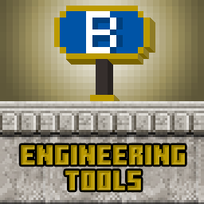
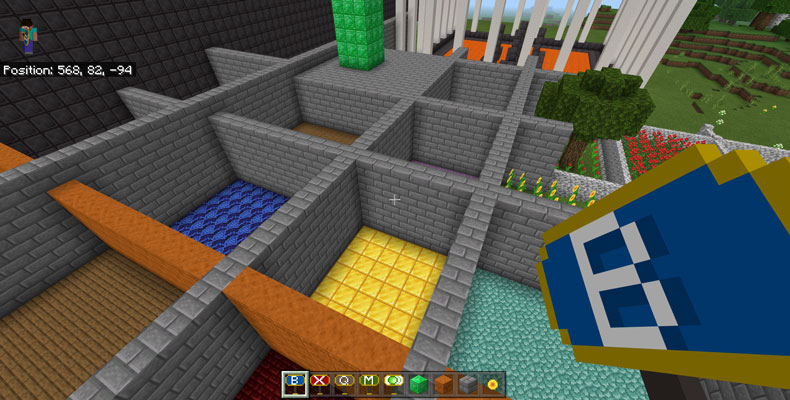
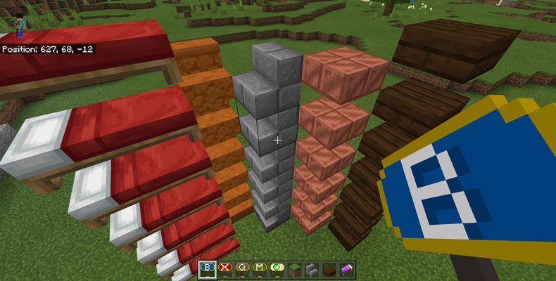
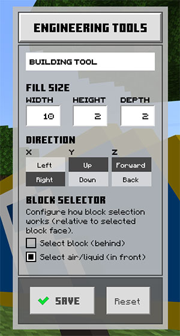

# Engineering Tools

## Add-on for building faster, bigger and longer in Minecraft Bedrock

***Windows 10 edition only***

- - -

Building anything big in Minecraft can be a chore! The Java edition has long had decent addons to help with putting down lots of block at the same time, but not so with the Bedrock Edition. Here's an addon that let's you do that. [Engineering Tools](https://github.com/galloppinggryphon/EngineeringTools) aims to be powerful yet user friendly: just point and click to quickly build large rectangular shapes, create vast caves or dig giant holes.

### Main Features

* 🟥 Quickly create large rectangular shapes from almost any block in any state
* 🟧 Easily create walls, buildings, towers, tunnels, mountains, caves and holes in the ground
* 🟩 Includes two building tools for creating or removing, and support tools for querying and measuring
* 🟨 Create filled~~or hollow~~shapes (#todo: hollow shapes)
* 🟦 Includes easily accessible GUI to configure tool settings: use shift key (the 'sneak' key!) to open
* 🟫 Uses the fill command behind the scenes
* ⬜ Bonus tool: Teleport quickly within line-of-sight with a single click

     

     

### Requirements

What you need:

* Minecraft Bedrock `v1.17+` for *Windows*
* Will probably work in `1.16.100+`, but this version is only tested in 1.17.

### **Limitations**

* Only for Windows because it relies on the scripting engine and GUI engine -- neither are available in mobile editions
* Single player games only
* Education Edition has not been tested
* Only works in creative mode

***This is a preview version, it may be unstable. Don't use it in any world you're really attached to.***

     

🟥🟧🟨🟩🟦🟪🟫⬜

## Highlights

### Build large structures

 
### Build with stairs, slabs and (some) items

 
### Configure tools with a graphical interface

[Find more screenshots in the screenshots folder](./screenshots).

     

🟥🟧🟨🟩🟦🟪🟫⬜

## Getting Started

**Engineering Tools consts of two parts:**

1. `Behaviour Pack`: Contains items and scripting logic.
2. `Resource Pack`: Contains GUI and textures/icons

**Both packs must be installed and enabled for the addon to work.**

### Manual installation required

It's necessary to manually install Engineering Tools in the Bedrock addon development folders. An auto-installing edition may follow later.

#### Instructions

1. Download zip file and extract or git clone the repository into an empty folder
2. Open another Explorer window and navigate to the Bedrock user data folder:
`%LocalAppData%\Packages\Microsoft.MinecraftUWP_8wekyb3d8bbwe\LocalState\games\com.mojang` (copy and paste this path into Explorer)
3. Copy `EngToolsRP` to `development_resource_packs`
4. Copy `EngToolsBP` to `development_behavior_packs`

### Required world settings

***Make sure you apply both the**`behaviour pack` **and the**`resource pack` **for worlds where you want to use the addon.***

**The following world settings must be enabled:**

* `Cheats`
* `Creative Mode`

**Experimental world settings:**

* `Holiday Creator Features`: To create custom blocks/items
* `Additional Modding Capabilities`: For scripting
* `Upcoming Creator Features`: For block permutations (example blocks)

     

🟥🟧🟨🟩🟦🟪🟫⬜

## Using Engineering Tools

### Tools

#### Included tools

* `Building Tool`: Build rectangular structures
* `Destruction Tool`: Destroy blocks inside a rectangular area
* `Query Tool`: Get block name and block state from existing block to use with the Building Tool
* `Measuring Tool`: Measure distances. Optionally, automatically update width, height or depth for the Building Tool or Destruction Tool
* `Teleport`: Quickly jump long distances within line of sight

The tools are located under the `Equipment` tab in the inventory.

#### Finding and using the tools

* 🟨 Look in the `Equipment` section in the block selector window (usually accessed with the `e` key)
* 🟨 Also possible to retrieve with the command `/give @s engtools:*`
* 🟨 Place tool in main hand to use
* 🟨 Follow instructions that pop up above the action bar (known bug: messages need to stay on screen longer)

***Known Minecraft Bug:***
For some undiscernable reason, Minecraft places the Query Tool and Teleport under the `Construction` tab.

#### Building Tool

* 🟩 Select the desired block to build with
* 🟩 There are two methods for selecting block type:
    1. Place a block from the hotbar - Engineering Tools always uses the last block placed
    2. Query a block with the `Query Tool`
* 🟩 Place `Build Tool` in main hand
* 🟩 Messages will appear above the hotbar with instructions and information
* 🟩 Point and click on a block with the `right mouse button` (unless customized) to select the start position
* 🟩 Click on the same block again to build

***Known Minecraft bug:***
Blocks with custom state (properties) cannot be placed.

#### Destruction Tool

* 🟥 Works the same way as the Building Tool, but fills a rectangular area with `air`

#### Query Tool

* 🟫 Use to get information about an existing block, including type and block state
* 🟫 Very useful for getting a block's rotation (e.g. stairs)
* 🟫 Automatically updates the configured block to be used by the Building Tool

#### Measuring Tool

* 🟨 Use to measure distances - width, height and depth
* 🟨 Optionally update the settings for the active building tool (Building or Destruction Tool)

#### Graphical user interface

* 🟧 Use the configuration GUI to change tool settings
* the shape and size of the fill area (see below)
* 🟧 Parameters are not shared between tools
* 🟧 To access the GUI, press `shift` (or the button configured for sneaking and descending during flight)
* 🟧 Because the sneaking key is repurposed, sneaking or flying while holding a tool will be awkward. Cycle to another hotbar item if you need to fly or sneak

**Configurable settings (for some tools):**

* Fill size: width, height and depth
* Build direction: Select in what direction to create blocks relative to the player. By default places blocks away from (forward), up and to the right of the player.
* Block selector: Select which block to target when pointing the mouse -- choose the block under/behind the mouse pointer or the empty block (air/water or lava filled block) in front of it.

#### General tips

* 🟦 To reset tool coordinates, cycle to another item in the hotbar and back
* 🟦 Building vast shapes (on the order of tens of thousand of blocks) quickly adds to the stored data of the world and the CPU power required to process it
* 🟦 Max supported number of blocks that can be filled (x times y times z) is 32,768
* 🟦 Remember: there is no undo button in Minecraft
* 🟦 Always make a backup of your world before attempting major operations

#### **Bonus: Teleport Tool**

* 🟪 Not a building tool but it makes it much faster to move around - more convenient than Ender Pearls
* 🟪 Teleport anywhere within line-of-sight, but with a configured max range (hard coded at this time, may changed from version to version)
* 🟪 Just point and right click to use

     

🟥🟧🟨🟩🟦🟪🟫⬜

## A few words of wisdom

> **Do or do not, there is no undo.**
> 
> **With more power comes the ability to make bigger and faster mistakes.**
> 
> **Backup your world frequently.**
> 
> **Build faster and bigger, but maybe not better, unless you equate *more* with *better*.**
> 
> **No guarantees that this software will work as implied and not turn your computer into a pile of frogs.**
> 
> **Do not look into laser with remaining eye.**

     

🟥🟧🟨🟩🟦🟪🟫⬜

## Future plans

* [ ] Enable the other capabilities of the fill command: replace blocks of a certain type, create hollow shapes.
* [ ] More options for controlling building, e.g. selecting corners with the mouse instead of configuring size
* [ ] Templates for common shapes and maybe also building materials (e.g. brick walls)
* [ ] Maybe support more sophisticated shapes, e.g.triangles, rotated cubes (slopes)
* [ ] Copy settings between tools in the GUI

     

🟥🟧🟨🟩🟦🟪🟫⬜

## **Known issues**

**Minecraft limitations**

* Items (like beds) can behave unpredictably when placed with the Building Tool -- always test first
* Not possible to use custom blocks with custom states. See bug [MCPE-116750](https://bugs.mojang.com/browse/MCPE-116750)
* Some tools are mistakenly placed in the Construction tab
* Some items will trigger interaction when clicked on with the Query Tool or Measuring Tool (e.g. levers)
* Failure to get coordinates of selected block: When pointing at far-away blocks, Minecraft does not always return a target. Mostly an issue for the Query Tool, possibly Teleport

**Bugs**

* Short timing of action bar messages - in theory possible to control, in practice I don't know how yet
* Writing to the log is not working

**Fixed (probably!)**

* Coordinate rounding error: Minecraft sometimes returns coordinates with a tiny rounding error that makes ot more difficult to detect the correct block face. A work-around has been created and seems to be working.

     

🟥🟧🟨🟩🟦🟪🟫⬜

## FAQ (Frustrations and Questions)

### It doesn't work!?

One of the following things are happening:

* The tools cannot be found
* Nothing happens when I right click or press the shift key
* I get a red error message in the chat/console when I try to use a tool

#### Answer 1

Most likely Engineering Tools is not installed correctly, or some crucial world settings are not enabled. Scroll up and carefully read (and apply) all the instructions in the `Getting Started` section.

#### Answer 2

Error may occur if you've placed tools in the action bar before enabling all required world settings (causing errors). Disabling and enabling Cheat mode can makee the tools misbehave. To fix this, remove the tools from the action bar, reload the world and then reequip.

     

🟥🟧🟨🟩🟦🟪🟫⬜

## License

### **Engineering Tools license**

Copyright © Bjornar Egede-Nissen, 2021
License: GNU General Public License v3.0 (GPL-v3)

[See full license text.](./license)

Engineering Tools, in whole or in part, must be redistributed under the GPL-v3 license, except under the conditions listed below and/or in the source code.
 
#### GPL-v3 summary

| Permissions | Conditions | Limitations |
| ----------- | ---------- | ----------- |
| <ul class="license-permissions"><li class="commercial-use" data-hasqtip="0" title="">Commercial use</li><li class="distribution" data-hasqtip="2" title="">Distribution</li><li class="modifications" data-hasqtip="4" title="">Modification</li><li class="patent-use" data-hasqtip="6" title="">Patent use</li><li class="private-use" data-hasqtip="8" title="">Private use</li></ul> | <ul class="license-conditions"><li class="disclose-source" data-hasqtip="10" title="">Disclose source</li><li class="include-copyright" data-hasqtip="12" title="">License and copyright notice</li><li class="same-license" data-hasqtip="14" title="">Same license</li><li class="document-changes" data-hasqtip="16" title="">State changes</li></ul> | <ul class="license-limitations"><li class="liability" data-hasqtip="18" title="">Liability</li><li class="warranty" data-hasqtip="20" title="">Warranty</li></ul> |

(Table copied from [https://choosealicense.com/licenses/gpl-3.0/](https://choosealicense.com/licenses/gpl-3.0/#))
 
### Exceptions and credits

Some parts of the software, as indicated in the source code or listed below, is licensed under different terms.
 
#### Blocks, items, models and build-scripts sub-folders
 
Any files in the `items`, `blocks`, `models` and `build-scripts` sub-folders, if present, may be distributed on their own under the MIT license.
Copyright © Bjornar Egede-Nissen, 2021.
License details: [https://choosealicense.com/licenses/mit/](https://choosealicense.com/licenses/mit/)

 
#### Third party code
 
##### Mojang

The `experimental_ui` folder includes font files and UI engine code distributed by Mojang © in a demonstration addon package.